# MorseBand

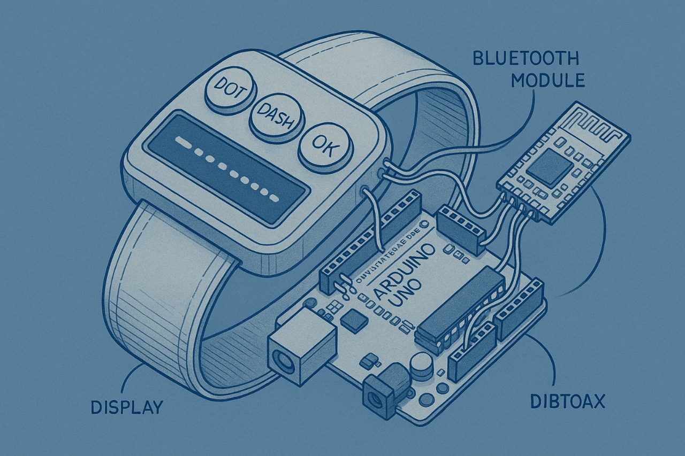

---

## Why MorseBand Matters

**Morse code** has enabled secure and resilient communication for nearly 200 years—across wars, espionage, and emergencies. Its simplicity makes it reliable even when modern tech fails.
  
  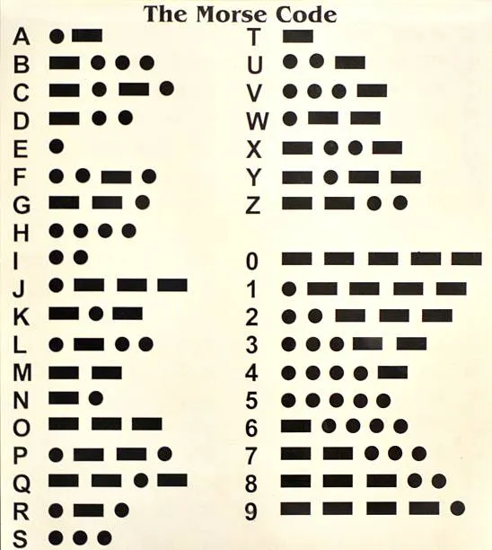

**MorseBand** modernizes this legacy, turning your wrist into a discreet, real-time Morse decoder.  
*For more, see [Morse code (Wikipedia)](https://en.wikipedia.org/wiki/Morse_code).*

---

## Project Overview

**MorseBand** is a wearable band that decodes your dot/dash taps into live text—displayed on an OLED or LCD, and streamed via Bluetooth to any device.  
Perfect for Morse learning, accessibility, or your own “spy gadget” build!

---

## 🛠️ Hardware Used

1. **Arduino Uno R3**  
   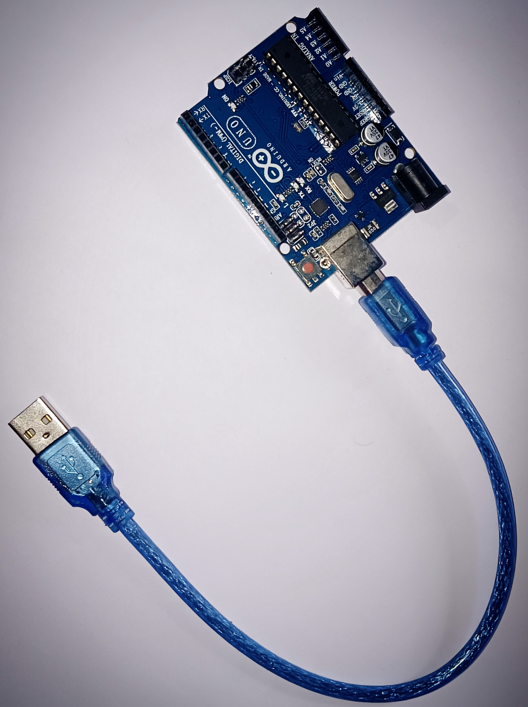  
   [Arduino Uno R3 (Wikipedia)](https://en.wikipedia.org/wiki/Arduino_Uno)  
   *Brains of the project—runs all code and controls I/O.*

2. **Bluetooth Module (HC-05)**  
   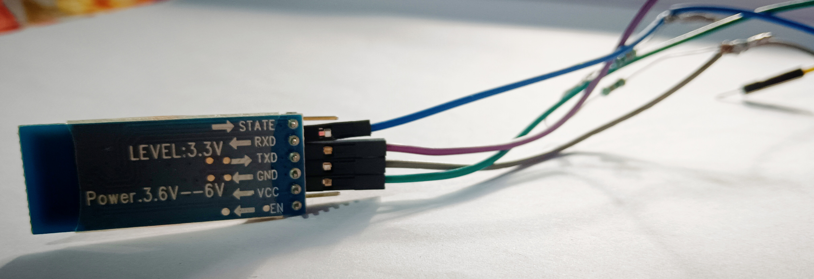  
   [Bluetooth (Wikipedia)](https://en.wikipedia.org/wiki/Bluetooth)  
   *Streams decoded text wirelessly to your phone or PC.*

3. **Resistors**  
   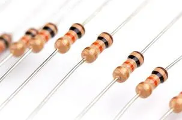  
   [Resistor (Wikipedia)](https://en.wikipedia.org/wiki/Resistor)  
   *10kΩ (×3) for buttons, 220Ω (×3) for LEDs (safe operation).*

4. **LEDs (3 colors)**  
   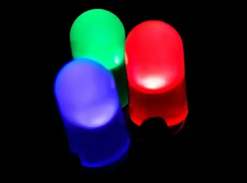  
   [LED (Wikipedia)](https://en.wikipedia.org/wiki/LED)  
   *Show which button is pressed: red=DOT, yellow=DASH, green=OK.*

5. **Tactile Push-Buttons (×3)**  
   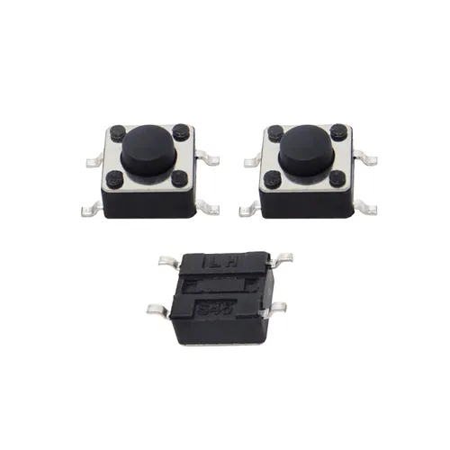  
   [Switch (Wikipedia)](https://en.wikipedia.org/wiki/Switch)  
   *DOT, DASH, and OK character entry.*

6. **LCD 16x2 Display**  
   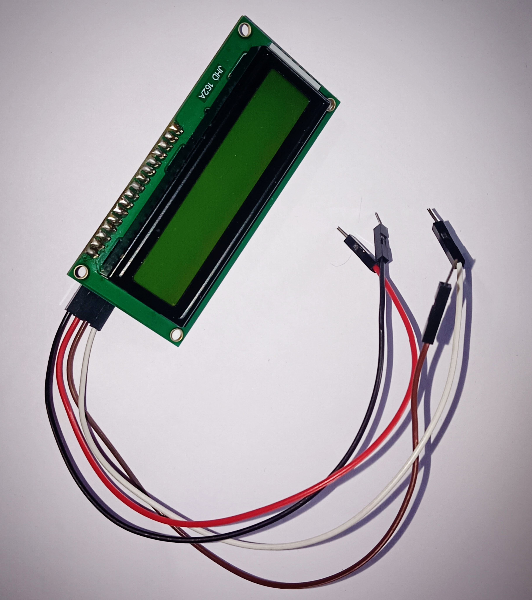  
   [LCD (Wikipedia)](https://en.wikipedia.org/wiki/Liquid-crystal_display)  
   *Shows decoded Morse text in real time.*

7. **I2C Module for LCD**  
   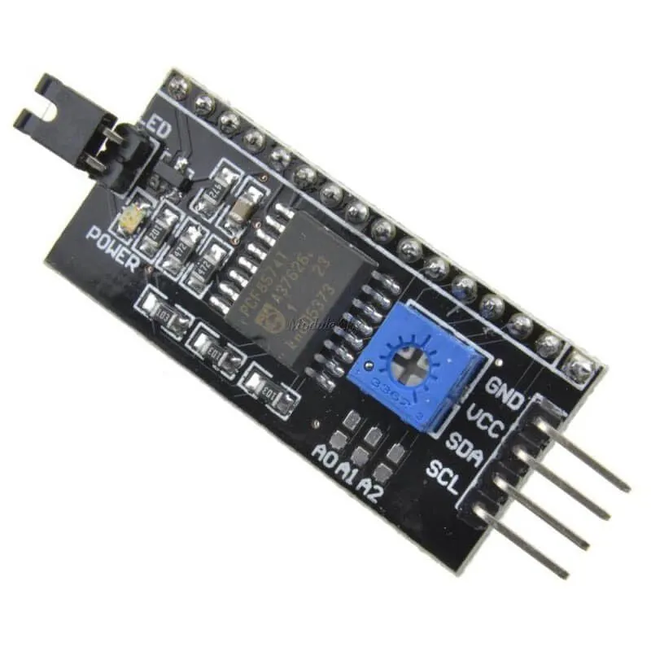  
   [I²C (Wikipedia)](https://en.wikipedia.org/wiki/I%C2%B2C)  
   *Lets the LCD use only two Arduino pins.*

8. **Jumper Wires**  
     
   [Jumper Wire (Wikipedia)](https://en.wikipedia.org/wiki/Jumper_(computing))  
   *All the connections—male-male and male-female.*

9. **Breadboard**  
   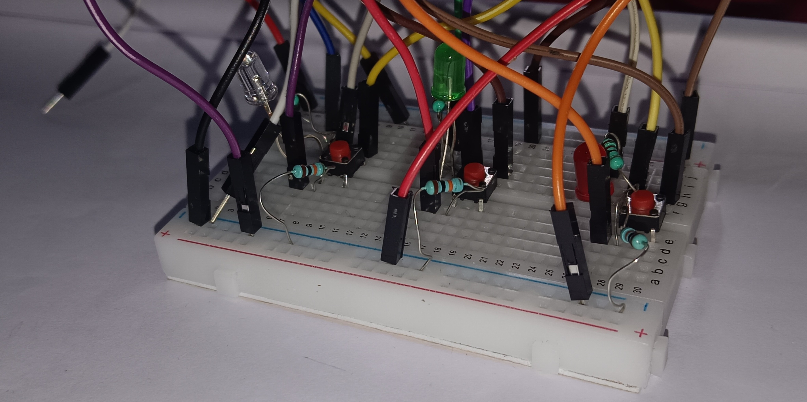  
   [Breadboard (Wikipedia)](https://en.wikipedia.org/wiki/Breadboard)  
   *Assemble the whole circuit—no soldering needed!*

10. **USB Cable (Arduino)**  
    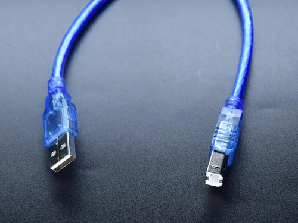  
    [USB (Wikipedia)](https://en.wikipedia.org/wiki/USB)  
    *Upload code and power the project.*

---

## 💻 Software & Libraries

### Arduino IDE 1.8.19

**Why?**  
Stable, widely compatible, and supports all required libraries.
- [Windows (.exe)](https://downloads.arduino.cc/arduino-1.8.19-windows.exe)
- [macOS (.zip)](https://downloads.arduino.cc/arduino-1.8.19-macosx.zip)
- [Linux (all)](https://www.arduino.cc/en/software/OldSoftwareReleases#1.8.x)

### Required Libraries

> Install all libraries via **Sketch → Include Library → Manage Libraries…**

- **Adafruit GFX**  
  *Universal graphics core—text and shapes on LCD/OLED.*  
  Install: “Adafruit GFX Library by Adafruit”, v1.11.6+

- **Adafruit SSD1306**  
  *OLED display driver—crisp, readable output.*  
  Install: “Adafruit SSD1306 by Adafruit”, v2.4.6+

- **LiquidCrystal_I2C**  
  *Easy 16x2 LCD text output over I²C.*  
  Install: “LiquidCrystal I2C by Frank de Brabander”, v1.1.2+

- **Wire**  
  *I²C comms for LCD/OLED—built-in, no install needed.*

- **SoftwareSerial**  
  *Serial on extra pins for HC-05—built-in, no install needed.*

---

## 🚀 Getting Started

1. Build the circuit per the images/wiring diagram.
2. Install Arduino IDE & all listed libraries.
3. Open the project sketch (`MorseBand.ino`) and upload to your Uno.
4. Open Serial Monitor (**9600 baud**) or connect via Bluetooth.
5. Tap Morse code: decoded letters appear instantly on your display and phone/PC!

---

## 📄 Main Code

[**View MorseBand.ino**](MorseBand.ino)  
*Or copy it directly from the repo’s `MorseBand.ino` file.*

---

## 🙏 Thank You

MorseBand is open-source and ready for your ideas!  
Found an issue, want to improve, or built something cool? Open an issue or PR—let’s build together.  
**Happy making and decoding!**

## 💖 Support & Donate

If you love this project and want to support its development, you can help by donating!  
Every small contribution keeps me motivated to build more open-source projects. 
If you find it helpful, consider donating just **($5)** via UPI. Every bit means a lot! 🙏

**Scan QR :**  🚀

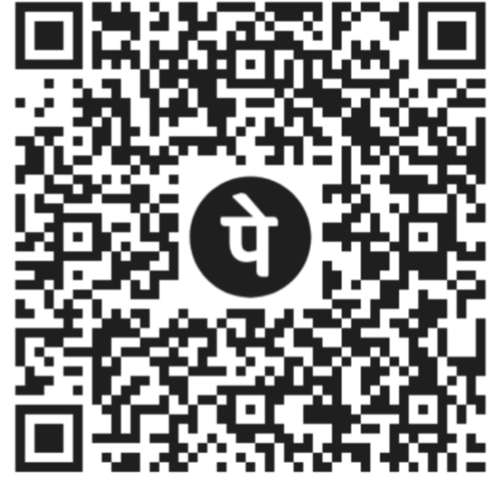

---
### 🌟 Motivation Corner

> "Raste mushkil hain toh kya, himmat saath hai,  
> Koshish karte raho, manzil paas hai."
---
